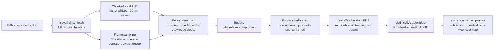

# EchoNotes

> Turn a course video into a verifiable LaTeX handout.
> 把课程视频"听"成一份可查证的 LaTeX 讲义。

**Input**: a Bilibili course link (or a local video). **Output**: a Chinese LaTeX/PDF
handout with a full evidence chain — every formula can be traced back to a timestamp
and a screenshot of the original blackboard, every AI-generated addition is clearly
marked, and open questions are never silently dropped.

| Content and evidence | Blackboard evidence appendix |
| --- | --- |
|  |  |

*Screenshots are produced by the pipeline's own synthetic offline test fixture, not
from any third-party course.*

## Why "transcribe + summarize" is not enough

A transcript is not a handout: formulas must be read off the blackboard, AI
additions must be separable from what the lecturer actually said, and "inventing a
plausible formula" is unacceptable in a math course. EchoNotes answers with an
**evidence discipline**:

- **Every passage and every formula carries its sources**: `segment_ids`
  (transcript segments) and `frame_ids` (blackboard frames); the code rejects
  fabricated evidence IDs.
- **Second-pass visual verification**: extracted formulas are sent back to the
  vision model together with their original frames, recorded as
  `match / mismatch / unclear` — never silently "corrected into a well-known formula".
- **Open questions stay visible**: blurry boards, audio-visual contradictions and
  orally-derived formulas all land in `uncertainties`.
- **The model produces content only, never layout**: LaTeX templates, math command
  whitelists and page layout are fully controlled by code — the model has zero
  typesetting freedom.
- **Layered annotation**: course-sourced content and AI-generated derivations are
  visually distinguishable in the deliverable (〔supplement〕 markers, green
  annotation bars).

## How it works



### Automatic run-cache cleanup

On success the pipeline packages everything into **one folder per course** and
deletes all intermediates:

```
archive/
└─ <BV>-P<page>-<course title>/
   ├─ lecture.pdf      # compiled handout
   ├─ lecture.tex      # LaTeX source (recompile needs sibling frames/)
   ├─ frames/          # deduplicated screenshots referenced by the handout
   ├─ lecture.json     # full evidence chain, drillable
   └─ README.md        # source, stats, model config, usage boundaries
```

Cache is always kept while retrying after failures; pass `--keep-cache` to opt out
of automatic cleanup.

## Three pipelines

| Pipeline | Input | Output | Status |
|------|------|------|------|
| 1 · Monologue/opinion | Podcasts, opinion videos (audio only) | Reading-notes HTML + cleaned transcript | ✅ Shipped |
| 2 · Course | Math/academic courses (multi-part supported) | LaTeX/PDF handout + audio-visual evidence chain | ✅ Shipped, verified on a 138-minute real course |
| Study handout | pipeline 2's lecture.json | Publication + card edition PDFs + course concept map | ✅ Shipped |
| 3 · Hands-on tutorial | PS/drawing/dev tutorials | Handout + lab report + reproduced artifact | Designed, not started |

## Quick start

Requirements: Python 3.11+, `ffmpeg` / `ffprobe` / `XeLaTeX` on PATH, plus
`faster-whisper` and `Pillow` (details in the
[operation manual](work/pipeline2/README.md), currently in Chinese).

API keys live in an external JSON file (format in the manual; the repo never
contains keys):

```json
{"entries":[{"provider":"deepseek","label":"...","apiKey":"...","baseUrl":"...","models":["deepseek-chat"]}]}
```

```powershell
# 0. Dependency check
python -m work.pipeline2.pipeline2 doctor

# 1. Course video to evidence handout (run cache auto-cleaned on success)
python -m work.pipeline2.pipeline2 run 'https://www.bilibili.com/video/BV.../?p=2' `
  --secrets 'path/to/secrets.json'

# 2. lecture.json to study handout (publication + card editions + concept map)
python -m work.pipeline2.study 'archive-folder/lecture.json' `
  --output-root 'output/学习讲义' --secrets 'path/to/secrets.json'
```

All models are configurable (defaults: DeepSeek for text + a multimodal vision
model); planner/writer roles can be pointed at token-plan style endpoints. The full
environment variable reference is in the
[operation manual](work/pipeline2/README.md).

## Study handout: four writing passes

On top of the evidence handout, the study pipeline rewrites the material per
continuous semantic unit into a publication-grade handout that can be read
independently. All four passes are cached and preserve classroom evidence IDs:

1. **Draft**: cleaned explanation + LaTeX notes + learning goals
2. **Publication-level deepening**: fills skipped derivation steps, adds minimal
   computable examples — the code rejects additions that drop classroom sources
3. **Math review**: unit-by-unit revision with reasons recorded in the quality report
4. **Style unification**: consistent terminology and voice across the book,
   edits restricted to annotations

Once the course map is locked, a **course concept map** is generated (8-20 concept
nodes, four relation types; the model only decides concepts and relations — all
layout is computed in Python). The same content ships in two layouts: a publication
edition (continuous prose + 〔supplement〕 markers + green annotation bars) and a
card edition (colored knowledge cards).

## Fault tolerance

Long multi-model runs inevitably hit network glitches, rate limits and format
slips. Fault tolerance has five layers, all configurable
(`ECHONOTES_MODEL_RETRIES / BACKOFF / TIMEOUT`, `ECHONOTES_ASR_CHUNK_SECONDS`):

| Layer | Problem | Mechanism |
|---|---|---|
| ASR | A 2-hour audio file blows up memory in one giant STFT | 10-minute chunked transcription with timestamp offsets |
| Model request | Network glitches, rate limits, slow generation | Stepped-backoff retries (default 3 × 10/20s, timeout 180s, configurable) |
| Model output | Occasional JSON escaping / missing fields | One encoding-repair retry + per-window validation retries |
| Stage cache | Any step fails | Cache keyed by input/model/prompt/frame digests; retries resume at the breakpoint |
| Run cleanup | Intermediate-file accumulation | Run directory auto-deleted once the deliverable folder is verified |

## Honest limitations

- **A successful compile does not mean mathematical correctness**; a second visual
  pass is not an independent math review. Re-watch the original video before
  serious use.
- Frame intervals can miss briefly shown blackboards; there is no automatic
  catch-up loop yet — tighten the interval and rerun.
- "All generated blocks are kept" is not "full semantic coverage of the video";
  unreferenced transcript segments and frames are listed for human review.
- No evidence-free proof completion; ambiguous symbols and contradictions are
  preserved as open questions.
- Bilibili API availability depends on login state and access permissions.

## Repository layout

```
work/
├─ pipeline1/     # monologue video to reading-notes HTML (shipped)
├─ pipeline2/     # course video to evidence handout + study handout (core)
│  ├─ pipeline2.py   # entry: run / distill / doctor
│  ├─ asr.py         # chunked local transcription
│  ├─ media.py       # download, frame sampling, dedup
│  ├─ writing.py     # map / reduce / formula verification / quality report
│  ├─ study.py       # study handout: four writing passes
│  ├─ concept_map.py # course concept map (Python-controlled layout)
│  ├─ render.py      # LaTeX rendering and compilation
│  ├─ distill.py     # deliverable-folder packaging
│  └─ tests/         # 29 unit/integration tests
└─ docs/
```

Design background: [方案-三类视频内容分管线设计.html](方案-三类视频内容分管线设计.html)
(Chinese); study-handout design:
[work/pipeline2/LEARNING_DESIGN.md](work/pipeline2/LEARNING_DESIGN.md) (Chinese).

## Development

```powershell
# Unit + integration tests (29; integration uses real ffmpeg/XeLaTeX with a fixed fake model)
python -m unittest work.pipeline2.tests.test_core work.pipeline2.tests.test_models `
  work.pipeline2.tests.test_media work.pipeline2.tests.test_pipeline `
  work.pipeline2.tests.test_cloud_asr work.pipeline2.tests.test_study

# End-to-end integration demo (real ffmpeg + real XeLaTeX, fake model, sample PDF)
python -m work.pipeline2.tests.test_pipeline 'output/pipeline2-integration'
```

The synthetic fixture proves pipeline connectivity and interface contracts only —
it is not a recognition-quality benchmark.

## Roadmap

- [x] Pipeline 1 end-to-end
- [x] Pipeline 2: hybrid frame sampling + multimodal blackboard + map-reduce + LaTeX/PDF
- [x] Verified on a 138-minute real course (Kevin Wood robotics, Chinese dub)
- [x] Study handout: four passes + concept map + publication/card editions
- [x] Deliverable-folder packaging + automatic run-cache cleanup
- [ ] Automatic catch-up for briefly shown blackboards
- [ ] Batch mode: full collections / uploaders to multiple deliverable folders + index
- [ ] Pipeline 3: hands-on tutorials to reproduction + lab reports
- [ ] Native whole-video understanding via Gemini

中文版本：[README.md](README.md)
