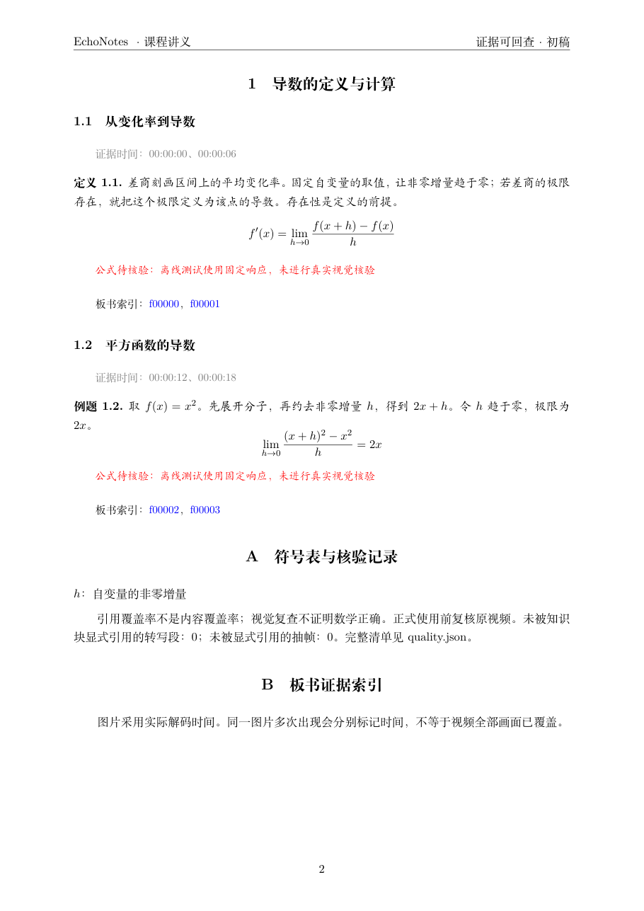
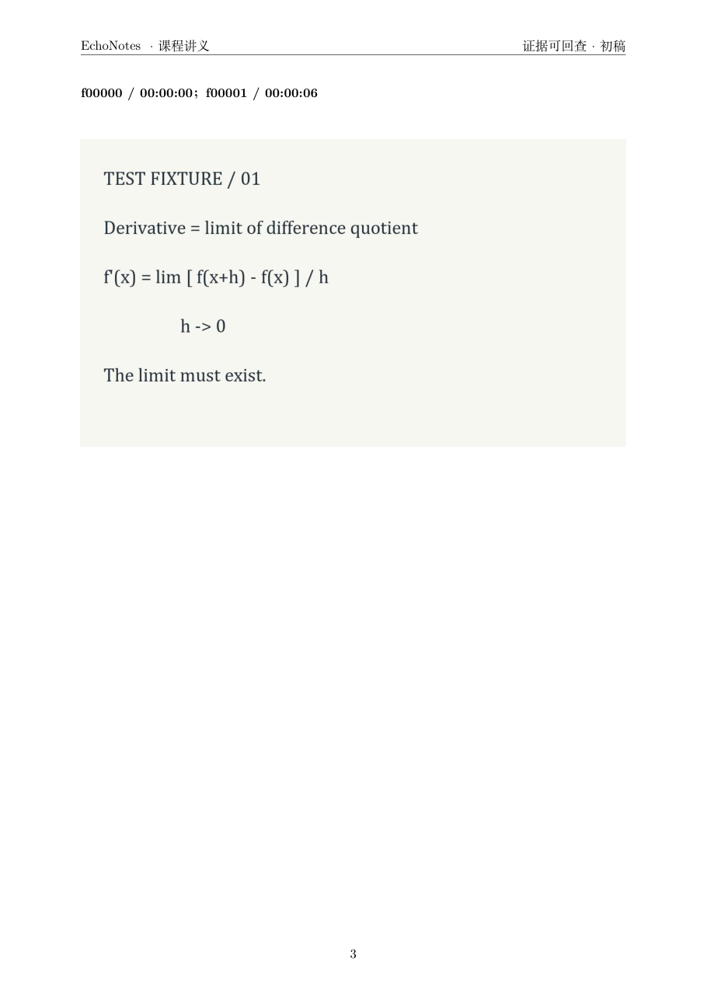
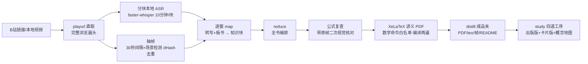
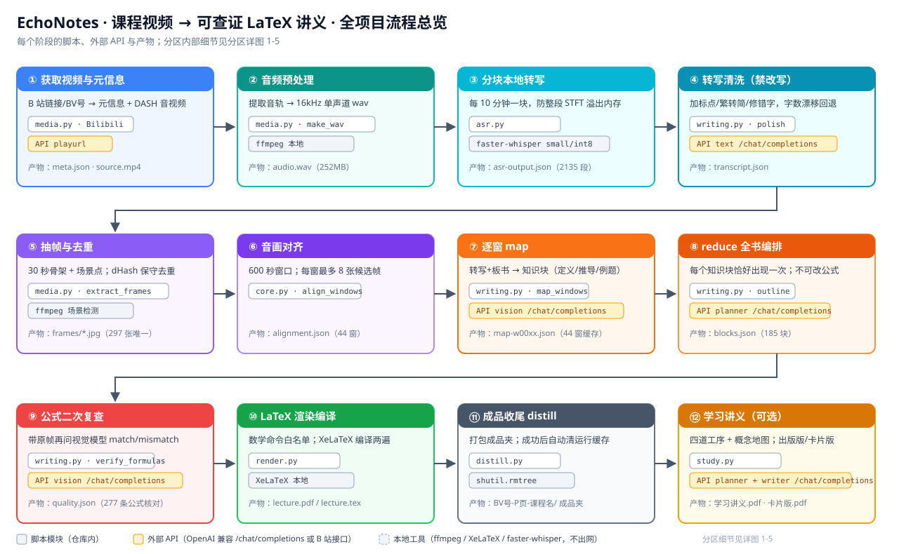
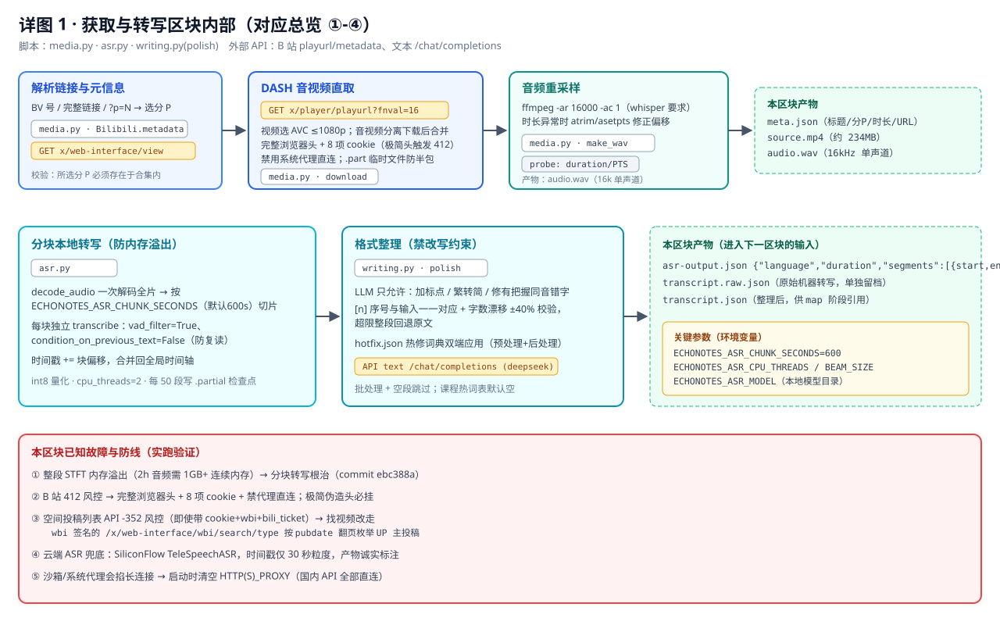
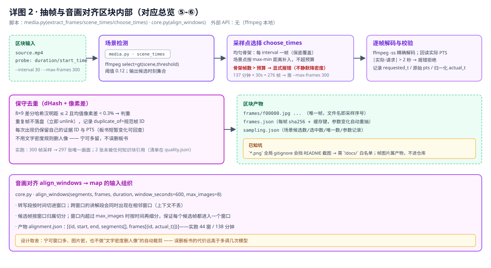
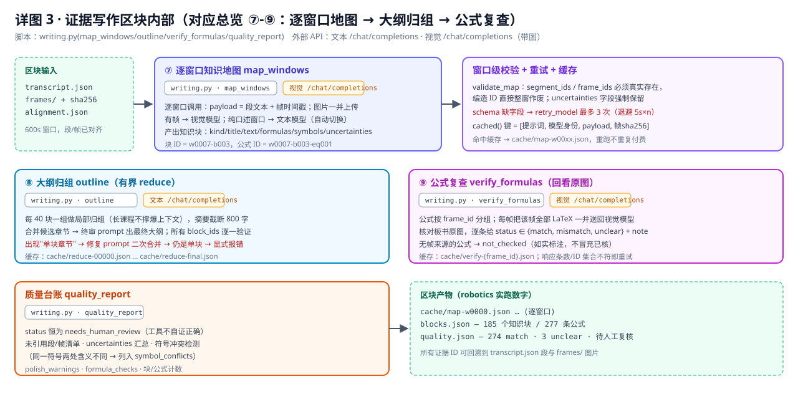
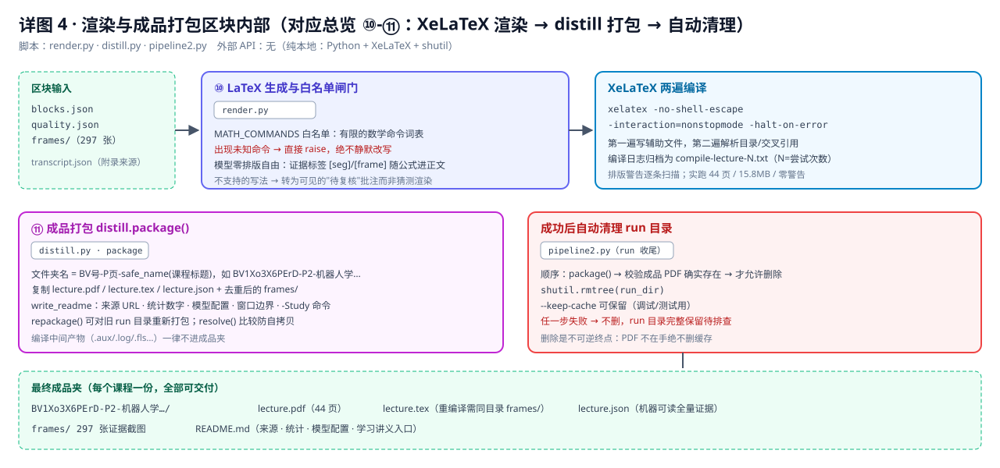
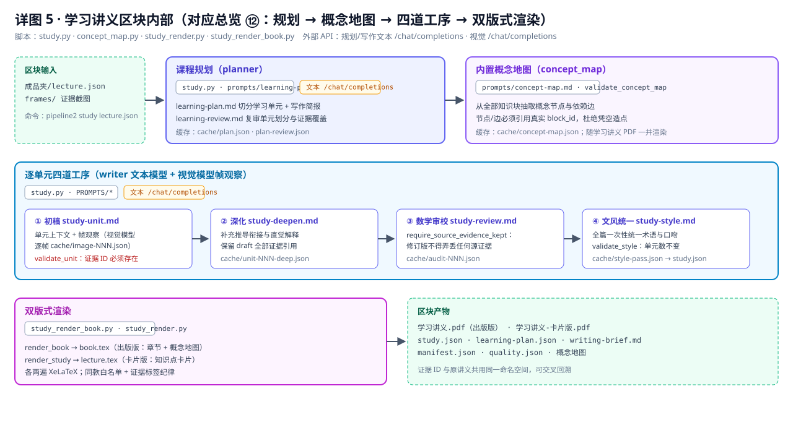

# 拾音笺 EchoNotes

> 把课程视频"听"成一份可查证的 LaTeX 讲义。
> Turn a course video into a verifiable LaTeX handout.

**输入** 一个 B 站课程链接（或本地视频），**输出** 一份带完整证据链的中文 LaTeX/PDF 讲义：
每条公式可下钻到原视频的时间戳与板书截图，每处 AI 补充都明确标注，疑点不静默。

| 正文与证据 | 板书证据附录 |
| --- | --- |
|  |  |

*截图为管线自制合成样例（离线测试夹具），非任何第三方课程内容。*

## 为什么不用"转写 + 总结"

转写稿不等于讲义：公式必须看板书才能还原，AI 补充必须与课堂内容区分，
"编造一个看起来对的公式"在数学课上不可接受。EchoNotes 的回答是**证据纪律**：

- **每段讲解、每条公式都带来源**：`segment_ids`（转写段）与 `frame_ids`（板书帧），
  代码层拒绝虚构的证据 ID；
- **公式二次视觉复查**：提取出的公式会带原始帧再喂给视觉模型一次，记录
  `match / mismatch / unclear`，绝不"修成常见公式"；
- **疑点不静默**：模糊板书、音画矛盾、只有口述依据的公式全部写入 `uncertainties`；
- **模型只产内容，不碰排版**：LaTeX 模板、数学命令白名单、版式全部由程序控制，
  模型没有排版自由度；
- **分层标注**：课堂来源与 AI 补充推导在成品里视觉可区分（〔补充〕标记、批注绿线）。

## 工作原理



**全流程总览**（每个区块标注所用脚本、外部 API 与产物）：



**区块内部详图**（每个区块内部的脚本、API、输入输出）：

| 详图 | 覆盖区块 |
|------|----------|
|  | ①-④：B 站元数据 / playurl 直取 / 分块 ASR / 清洗对齐 |
|  | ⑤-⑥：场景检测 / 采样点选择 / dHash 去重 / 窗口对齐 |
|  | ⑦-⑨：逐窗口地图 / 有界 reduce / 公式回看复查 |
|  | ⑩-⑪：LaTeX 白名单闸门 / 两遍编译 / distill 打包与自动清理 |
|  | ⑫：课程规划 / 概念地图 / 四道工序 / 双版式渲染 |

### 运行缓存自动收尾

成功收尾后，管线自动把运行目录打包成**每课一个成品夹**并删除全部中间产物：

```
归档/
└─ BV号-P页-课程名/
   ├─ lecture.pdf      # 编译好的讲义
   ├─ lecture.tex      # LaTeX 源码（重编译需同目录 frames/）
   ├─ frames/          # 讲义引用的去重截图
   ├─ lecture.json     # 全证据链，可下钻
   └─ README.md        # 来源、统计、模型配置、使用边界
```

失败重试期间缓存始终保留；`--keep-cache` 可退出自动清理。

## 三条管线

| 管线 | 输入 | 输出 | 状态 |
|------|------|------|------|
| 一 · 口播/观点类 | 播客、观点视频（纯音频） | 读书笔记 HTML + 整理版逐字稿 | ✅ 已落地 |
| 二 · 课程类 | 数学/学术课程（含分 P） | LaTeX/PDF 讲义 + 音画证据链 | ✅ 已落地，138 分钟真实课程验收 |
| 学习讲义 | 管线二的 lecture.json | 出版版 + 卡片版 PDF + 课程概念地图 | ✅ 已落地 |
| 三 · 实操教程类 | PS/绘画/开发教程 | 讲义 + 实验报告 + 复刻作品 | 设计完成，待启动 |

## 快速开始

依赖：Python 3.11+，`ffmpeg` / `ffprobe` / `XeLaTeX` 在 PATH 中，`faster-whisper` 与 `Pillow`
（详见 [管线二使用手册](work/pipeline2/README.md)）。

密钥通过外部 JSON 文件提供（格式见手册，仓库不含任何密钥）：

```json
{"entries":[{"provider":"deepseek","label":"...","apiKey":"...","baseUrl":"...","models":["deepseek-chat"]}]}
```

```powershell
# 0. 自检依赖
python -m work.pipeline2.pipeline2 doctor

# 1. 课程视频 → 证据讲义（成功后运行缓存自动清理）
python -m work.pipeline2.pipeline2 run 'https://www.bilibili.com/video/BV.../?p=2' `
  --secrets '你的密钥文件路径'

# 2. lecture.json → 学习讲义（出版版 + 卡片版 + 概念地图）
python -m work.pipeline2.study '归档成品夹/lecture.json' `
  --output-root 'output/学习讲义' --secrets '你的密钥文件路径'
```

模型全部可配（默认 DeepSeek 文本 + 视觉多模态），支持把规划/写作角色接到
token plan 类端点；环境变量清单见[使用手册](work/pipeline2/README.md)。

## 学习讲义：四道工序

在证据讲义之上，study 管线按连续语义单元重写为"能独立阅读"的出版级讲义，
四道带缓存的工序全部保留课堂证据 ID：

1. **初稿**：整理讲解 + LaTeX 笔记 + 学习目标
2. **出版级深化**：补全跳步推导、加最小可算例子——代码拒绝丢失课堂来源的扩写
3. **数学审校**：逐单元复核，修订理由写入质量报告
4. **文风统一**：全书术语与口吻一致，只允许改批注

课程地图锁定后另生成**课程概念地图**（8-20 个概念节点、四类关系边，
模型只决定概念与关系，排版布局全部由 Python 计算）。同一内容产出两种排版：
出版编排（连续行文 + 〔补充〕标记 + 批注绿线）与卡片编排（彩色知识卡）。

## 容错设计

长时间多模型调用必然遇到网络抖动、限流与格式失误，容错分五层，
全部参数可配（`ECHONOTES_MODEL_RETRIES / BACKOFF / TIMEOUT`、`ECHONOTES_ASR_CHUNK_SECONDS`）：

| 层 | 问题 | 机制 |
|---|---|---|
| ASR | 2 小时音频整段 STFT 撑爆内存 | 每10分钟分块转写，时间戳偏移合并 |
| 模型请求 | 网络抖动、限流、慢生成 | 阶梯退避重试（默认 3 次×10/20s，超时 180s 可调） |
| 模型输出 | 偶发 JSON 转义/漏字段 | 编码修复重试一次 + 窗口级校验重试三次 |
| 阶段缓存 | 任何一步失败 | 以输入/模型/prompt/帧内容摘要为键，重跑只补断点 |
| 运行收尾 | 中间产物堆积 | 成品夹校验通过后自动清理运行目录 |

## 诚实边界

- **编译通过不等于数学正确**；二次视觉核验也不是独立数学审稿，正式使用前回看原视频。
- 抽帧间隔会漏掉短暂板书，暂无自动补帧闭环，需调密重跑。
- "所有生成知识块都保留"不是"原视频语义全覆盖"；未引用的转写段与帧会列清单辅助人工审查。
- 不自动补全没有证据的证明；B 站接口可用性取决于登录态与访问权限。

## 仓库结构

```
work/
├─ pipeline1/     # 口播视频 → 读书笔记 HTML（已落地）
├─ pipeline2/     # 课程视频 → 证据讲义 + 学习讲义（核心）
│  ├─ pipeline2.py   # 总控：run / distill / doctor
│  ├─ asr.py         # 分块本地转写
│  ├─ media.py       # 下载、抽帧、去重
│  ├─ writing.py     # map / reduce / 公式复查 / 质量报告
│  ├─ study.py       # 学习讲义四道工序
│  ├─ concept_map.py # 课程概念地图（Python 全控排版）
│  ├─ render.py      # LaTeX 渲染与编译
│  ├─ distill.py     # 成品夹打包
│  └─ tests/         # 29 项单元/集成测试
└─ docs/
```

设计背景见 [方案-三类视频内容分管线设计.html](方案-三类视频内容分管线设计.html)，
学习讲义设计见 [work/pipeline2/LEARNING_DESIGN.md](work/pipeline2/LEARNING_DESIGN.md)。

## 开发

```powershell
# 单元 + 集成测试（29 项；集成测试用真 ffmpeg/XeLaTeX + 固定假模型）
python -m unittest work.pipeline2.tests.test_core work.pipeline2.tests.test_models `
  work.pipeline2.tests.test_media work.pipeline2.tests.test_pipeline `
  work.pipeline2.tests.test_cloud_asr work.pipeline2.tests.test_study

# 端到端集成演示（真 ffmpeg + 真 XeLaTeX，固定假模型，产出样例 PDF）
python -m work.pipeline2.tests.test_pipeline 'output/pipeline2-integration'
```

合成样例只证明管线连通与接口契约，不构成识别效果评测。

## 路线图

- [x] 管线一端到端全自动
- [x] 管线二：混合抽帧 + 多模态板书 + map-reduce + LaTeX/PDF
- [x] 管线二 138 分钟真实课程验收（Kevin Wood 机器人学，中文配音）
- [x] 学习讲义：四道工序 + 概念地图 + 出版版/卡片版双排版
- [x] 成品夹打包 + 运行缓存自动清理
- [ ] 短暂板书自动补帧闭环
- [ ] 批量模式：合集/UP 主全量 → 多成品夹 + 索引
- [ ] 管线三：实操教程 → 复刻 + 实验报告
- [ ] Gemini 原生整视频理解接入

English version: [README.en.md](README.en.md)
